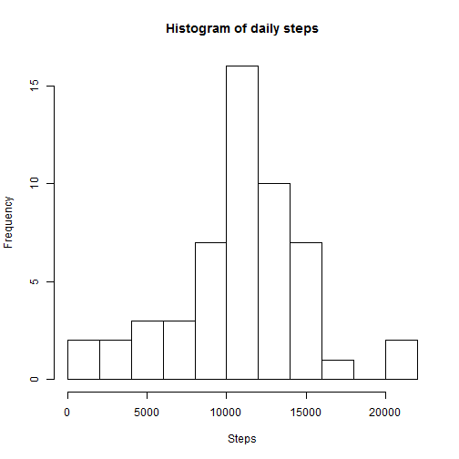
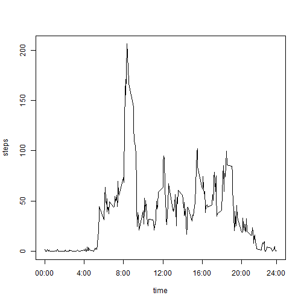
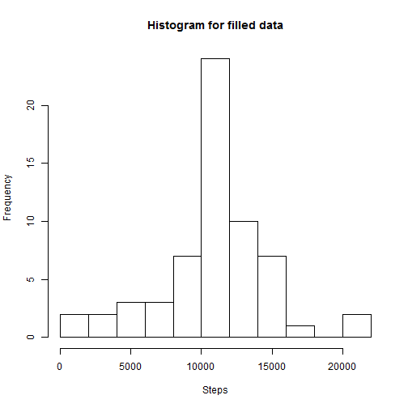
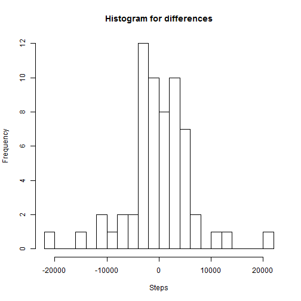
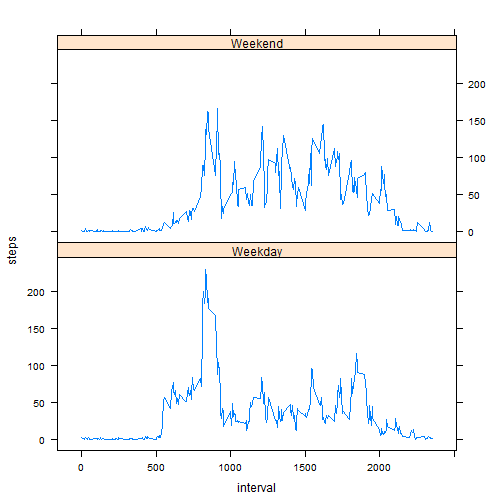

# Assignment 1: Activity monitoring analysis
========================================================

### Loading and preprocessing the data

In this assignment we analyse the dataset  [Activity monitoring data][refdat]. First we load the data into R as the data frame *activity*.

```r
activity <- read.csv("activity.csv", header=TRUE)
head(activity)
```

```
##   steps       date interval
## 1    NA 2012-10-01        0
## 2    NA 2012-10-01        5
## 3    NA 2012-10-01       10
## 4    NA 2012-10-01       15
## 5    NA 2012-10-01       20
## 6    NA 2012-10-01       25
```
### Daily activity pattern

To find daily activity pattern we create a new data frame with the total number of steps taken each day.


```r
daily <- aggregate(steps ~ date, data=activity, FUN=sum,  na.action = na.omit)
head(daily)
```

```
##         date steps
## 1 2012-10-02   126
## 2 2012-10-03 11352
## 3 2012-10-04 12116
## 4 2012-10-05 13294
## 5 2012-10-06 15420
## 6 2012-10-07 11015
```
To visualize the distribution  of the total number of steps taken each day a histogram is shown.


```r
hist(daily$steps,breaks=15, xlab = "Steps", main="Histogram of daily steps")
```

 

The mean and median of the total number of steps taken per day are shown below.

```r
mean(daily$steps)
```

```
## [1] 10766
```

```r
median(daily$steps)
```

```
## [1] 10765
```
A plot of the average number of steps for each 5-minute interval, where the observations are averaged across all days, shows that the largest values are around 8am.

```r
min5average <- aggregate(steps ~ interval, data=activity, FUN=mean,  na.action = na.omit)
plot(min5average, type="l", xlab="time", xaxt="n")
axis(1, at = c(0,400,800,1200,1600,2000,2355),labels=c("00:00","4:00","8:00","12:00","16:00","20:00","24:00"))
```

 

The following analysis

```r
maxinterval <- min5average$interval[min5average$steps==max(min5average$steps)]
maxinterval
```

```
## [1] 835
```

```r
maxsteps <- min5average$steps[min5average$interval==maxinterval]
maxsteps
```

```
## [1] 206.2
```
shows that the interval starting at 835 contains the maximum number of steps 206.1698.

### Analysis with imputing missing values

One can find that 2304  values out of 17568 are missing in the dataset: 

```r
sum(is.na(activity$steps)) 
```

```
## [1] 2304
```

To fill in the missing values in the dataset we use the mean for the corresponding 5-minute interval:


```r
activityfill <- activity
for (i in 1:length(activity$steps)){
  if (is.na(activity$steps[i])==TRUE)
{activityfill$steps[i] <- min5average$steps[min5average$interval==activity$interval[i]]}
}
```
The head of the resulting data frame is show below

```r
head(activityfill)
```

```
##     steps       date interval
## 1 1.71698 2012-10-01        0
## 2 0.33962 2012-10-01        5
## 3 0.13208 2012-10-01       10
## 4 0.15094 2012-10-01       15
## 5 0.07547 2012-10-01       20
## 6 2.09434 2012-10-01       25
```

and the following command confirms that there are no missing data in the created data frame 

```r
sum(is.na(activityfill$steps)) 
```

```
## [1] 0
```

We visualize the distribution  of the total number of steps taken each day for our new data frame. The new histogram is rather similar to the histogram we obtained before.


```r
dailyfill <- aggregate(steps ~ date, data=activityfill, FUN=sum)
hist(dailyfill$steps,breaks=15, xlab = "Steps", main= "Histogram for filled data")
```

 

The new estimated mean is exactly as before, and the new median is only slightly different from the previous result.

```r
mean(dailyfill$steps)
```

```
## [1] 10766
```

```r
median(dailyfill$steps)
```

```
## [1] 10766
```

Thus there is no impact of imputing missing data on the estimated mean and median of the total daily number of steps. However, one can  plot the histogram of differences between old and new data. The histogram shows that the distributions are different: 


```r
options(warn = -1)
hist(dailyfill$steps-daily$steps,breaks=15, xlab = "Steps", main= "Histogram for differences")
```

 

### Activity patterns on weekdays and weekends

To find differences in activity patterns between weekdays and weekends we create a new factor variable with two levels *Weekdays* and *Weekends*  indicating whether a given date is a weekday or weekend day:

```r
activityfill$weekends <- ifelse(weekdays(as.Date(activityfill$date))=="Saturday" | weekdays(as.Date(activityfill$date))=="Sunday", "Weekend","Weekday")
activityfill$weekends <- as.factor(activityfill$weekends)
```

Plots containing the 5-minute interval averaged number of steps for  weekend days and weekdays days are shown below


```r
library(lattice)
activi<- aggregate(steps ~ interval + weekends, data=activityfill, FUN=mean)
xyplot(steps~interval | weekends, data=activi, type="l", layout=c(1,2))
```

 


The histograms show that there are major differences in the distributions: 
* the morning peak around 8am on weekends is not so visible as during weekdays;
* during weekends the averages increase until 4pm and then decrease  
* during weekdays the averages increase until 7pm and then decrease 


[refdat]: https://d396qusza40orc.cloudfront.net/repdata%2Fdata%2Factivity.zip
